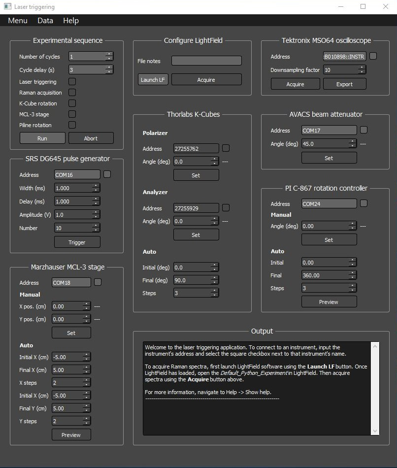

# Laser triggering: an application for high-throughput laser processing and characterization

This respository contains code for an application which allows in situ spectroscopic characterization of materials during automated laser processing. The application controls triggering of laser pulses, acquisition of Raman spectra, acquisition of traces from an oscilloscope, control of motorized translational stages, and control of motorized optical polarizer/analyzer systems.

A screenshot of the user interface is shown below.



# Use

The software can be run two different ways:


1. (recommended) Open the *Spyder* shortcut in the *C:\\Desktop\\eric\\* directory. *Spyder* is a Python editor which has been installed inside a virtual environment with specific Python packages required for this application. Once *Spyder* is opened, open the *app.py* file inside *Spyder* if it is not opened already. The *app.py* file should be located in the *C:\\Desktop\\eric\\laser_triggering\\* directory. Once *app.py* is opened in *Spyder*, run the file by clicking *Run*, or the green play button on the top toolbar.
2. Alternatively, the software can be started by double-clicking the ```RUN_LASER_TRIGGERING.bat``` Windows BAT file located in the *C:\\Desktop\\eric\\* directory. This BAT file will run the software but the user will not be able to see any errors which occurred.


When the application starts running, the gray user interface window should pop up. At any time while the application is running, the user can view this instruction file by navigating to the top menubar of the user interface and selecting **Help -> Show help**.


## Connecting to instruments
Once the application is running, the user will likely need to connect open connections to instruments. To view the avilable instrument addresses connected to the PC, select **Menu -> Show avilable instrument ports**. Addresses of each avilable VISA, serial, and FTID USB port will be printed in the output box on the user interface. To connect with a particular instrument, navigate to the box for that instrument on the front panel of the user interface. Enter the appropriate address for the instrument in the **Address** field, and click the checkbox adjacent to the address field to connect to the instrument. For example: to communicate with the SRS DG645 pulse generator, enter the serial port address (e.g. COM6) in the address field and select the checkbox to connect to the device. The output box will indicate if connection to the instrument was successful. 

Troubleshooting:
* Instruments may not be communicating properly unless they return an identification message in the outout box when the are connected. If an instrument will not connect, check that its address is correct, connection to the PC is good, and the instrument is powered on.
* Some instruments require a reboot before they can connect to the PC after a failed connection.
* The user may also determine whether the instument can be identified by the PC using Windows Device Manager or National Instruments Measurement & Automation Explorer (NI MAX).

### Connecting to LightField
To acquire Raman spectra using Princeton Instruments LightField software, LightField must be opened from the GUI by clicking **Launch LightField**. The Princeton Instruments laser and monochromator must be powered on. Once LightField loads, the user should load the LightField experiment called **Default Python Experiment**. After the experiment is loaded, settings can be modified in LightField. Raman spectra can be acquired by clicking the **Acquire Raman spectrum*** button on the *Laser triggering* user interface.

### Connecting to the SRS DG645 digital delay generator
The application is set up to trigger pulses from the SRS DG645 using the A-B output. So when using the SRS DG645 as an external trigger for an auxilary laser, connect the DG645 *A-B output* to the laser *external trigger* input.

### Connecting to Gentec S-Link photometer
The photometer will not communicate with the PC if it has been left in an inconsistent state. To reset connection to the PC, unplug the USB cable from the photometer for 5 seconds and then plug it back in. 

### Connecting to Thorlabs K-Cube KDC101 controllers
These controllers cannot be found by the computer if the ```import thorlabs_apt as apt``` command has been run before the controllers were connected to the PC. After they are connected, make sure the Python kernel has been restarted to allow initialization of ```APT.DLL``` while the controllers are connected and powered. 

### Connecting to Marzhauser MCL-3 stage controler
Make sure the "Joystick" knob on the front panel of the MCL-3 is in the "Auto" position. In the "Man" position, serial communication is disabled.

### Connecting to Laseroptik AVACS beam attenuator
The AVACS beam atenuator will not communicate with the PC unless the *Mode* is set to *Remote* on the top panel of the AVACS unit. 


## Running an experimental Sequence
The most valuable feature of this application is the ability to run an automated *experimental sequence*. The *Experimental sequence* box contains options for which instruments should be controlled during the *experimental sequence*. The sequence is started by selecting the *Run* button in the *Experimental sequence* box. Clicking *Abort sequence* will stop the sequence before it is complete. The sequence will initiate a procedure which runs *Number of cycles* times, with each cycle separated by *Cycle delay* number of seconds. Each checkbox that is checked in the *Experimental sequence* box will repeat during each cycle. For example, when *Laser triggering*, *Raman acquisition*, and *Polarizer rotation* checkboxes are all selected, the sequence will proceed as follows:
1. a list of polarizer angles is generated based on values in the *Start angle*, *End angle*, and *Steps* fields in the *Auto* section of the *Thorlabs controllers* box.
2. a Raman spectrum is acquired at each of the polarizer angles
3. the pulse generator is used to trigger laser pulses for material processing. The pulses are controlled by the *pulse width*, *pulse delay*, *pulse maplitude*, and *number of pulses* in the *Pulse generator* box.
4. Each step is repeated *Number of cycles* times.


## File output
Each time a Raman spectrum is acquired, the **Default_Python_Experiment** in LightField is configured to export the Raman spectrum as a *.csv* file, and the application log file is appended. The log file contains the list of experimental parameters that were active during each Raman acquisition, as well as the filename of the Raman spectrum. The log file can be found by selecting *Menu* -> *Show path to log file*, and the location of Raman spectra can be viewed by selecting *Menu* -> *Show acquisition file list*.


# Description of files

* **laser_triggering**: main directory which holds files and supporting directories 
    * **app.py**: main file for starting the GUI application. Calls _ui.ui_ and files inside _instr_files_ directory to create the application. Controls logic of the application and links GUI widgets to their actions.
    * **README.md**: the file you are reading, which describes instructions for use of the application
    * **README.html**: HTML version of the *README* file, which is generated automatically each time a user selects the *Help* menu on the unser interface
    * **ui.ui**: user interface file, created in QT Desginer, which is called by _app.py_ and provides thelayout of graphical user interface widgets for the application.
    * **RUN_LASER_TRIGGERING.bat**: Windows bat file. Make a shortcut of this file and place it anywhere on the PC to run _app.py_ by clicking on the shortcut.
    * **requirements.txt**: text file containing list of all dependencies. These can be installed using Anaconda as described in the _Installation_ section below.
* **instr_libs**: directory which contains Python scripts for controlling instruments and operation of the GUI
    * **avacs.py**: module for controlling Laseroptik AVACS beam attenuator
    * **kcube.py**: module for controlling Thorlabs KDC101 brushed servo motor controllers
    * **lf.py**: modules for controlling Princeton Instruments LightField software
    * **mcl.py**: module for controlling Marzhauser Wetzlar MCL-3 microscope stage controller
    * **mso.py**: module for controlling Tektronix MSO64 oscilloscope
    * **ops.py**: module for controlling operations and file I/O of the main GUI
    * **srs.py**: module for controlling SRS DG645 digital delay pulse generator
    * **slink.py**: module for controlling Gentech S-link photometer
* **logs**: default directory for saving experiment configuration files and logging experimental data
* **support_files**: directory for storing supporting Windows *DLL* files (_APT.dll_, _APTAPI.h_, _ATP.lib_) and other snippets of test code
* **img**: directory for storing images which are embedded in the README.md file


# Editing the software

To edit the user interface, use *QT Designer*. This program is installed by default with *Anaconda*. After *Anaconda* is installed, open the *Anaconda prompt*. In the command prompt, type ```designer``` and hit *enter*. The program *QT Designer* will open. Alternatively, open *Designer* using the *Designer* shortcut in the *C:\\Desktop\\eric\\* directory. Once *Designer* is opened, open the user interface design file *ui.ui*. The *ui.ui* file should be located in the *C:\\Desktop\\eric\\laser_triggering\\* directory. The user interface can now be edited. Each widget on the user-interface is named with a custom name, and this name is called by the *app.py* file to assign functionality to the widget. Beware that changing any widget names or deleting any of the widgets on the user interface file will cause errors in the Python code unless the code is updated to accomodate the changes.


The main script which opens up the user-interface file is *app.py*. This script contains code for connecting each user interface widget with associated functions to run when that widget is activated by the user. The script also calls other modules which control specific instruments. These are located inside the *instr_libs* directory. For example, the module *srs.py* inside the *instr_libs* directory contains code for controlling the SRS digital Delay Generator. In *app.py*, data is transferred between *app.py* and *srs.py* using the dictionary *self.srs*, which contains references to all SRS-related widgets on the user-interface.

The *app.py* and all other modules inside the *instr_libs* directory can be modified to add features or to add functions which are associated with new widgets in the *ui.ui* file.


# Installation of dependencies
Prior to use of *Laser triggering*, Python libraries and dependencies must be installed. To install dependencies, it is recommended to use Anaconda (https://www.anaconda.com/distribution/#download-section).

To install all dependencies on a Windows 64-bit computer, create an Anaconda environment and populate it with the required dependencies by opening the Anaconda command prompt and running: 
```conda create --name env --file requirements.txt```
where ```env``` is the name of the new environment.

After installation of the _thorlabs_apt_ library, three files in the support_files directory must be copied to the thorlabs_apt directory and placed in the same folder as _core.py_:
1. _APT.dll_
2. _ATP.lib_
3. _ATPAPI.h_

This allows communication between Thorlabs instruments, Windows, and Python.

The *PI_GCS2_DLL_x64.dll* library must be placed inside the same folder as the *piline.py* script for communication between Python and the PI hardware.

# Additional help
For additional help with this application, contact the author Eric: ericmuckley at gmail dot com.
